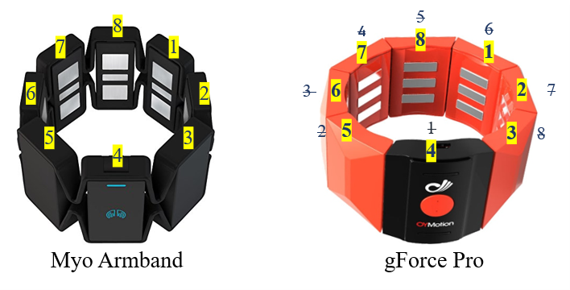

# Emg Data Acquisition System
## Description
This software allows to record hand gesture Emg and orientation signals using a surface Emg device. Compatible devices are Myo Armband and gForce Pro.

The data collected in this interface is fully compatible with [Manual Segmentation](https://github.com/laboratorioAI/manualSegmentation).

# Instructions
* Check the list of data collectors in the excel file **configs/list of collectors.xlsx**. 
* Check the list of devices in the excel file **configs/list of devices.xlsx**. 
Go to the repository root folder and just execute the script *ejecutar.m* in matlab.

# Requirements

## Myo
Using the Myo Armband has an easier installation procedure. 
Check the [MyoMex repository](https://github.com/mark-toma/MyoMex) for the tutorial installation.
We have included in this repository a copy of MyoMex.

## Gforce
The **gForce_mex** function must be compiled and added to the path. If you receive an error about it, check the gForce_interface project for help.
## Including Gforce in the proyect
Be sure to have correctly install gForce Mex. Check the [Installation Guide](https://github.com/laboratorioAI/gForce_interface)
for the complete tutorial.

We recommend any of the following 2 options to include gForce:
1. copy and paste in this folder the gForce package (i.e. **/export_mexMatlab/**), or
1. add the gForce directory to the Matlab path.

# gForce Pro and Myo Armband
The compatible devices have a couple of difference that were taken into account in our system to make the data recorded compatible between devices. 
1. **Emg sampling rate:** Myo Armband samples at 200Hz, whereas gForce Pro, was set at 500Hz (although it can up to 1kHz). The sampling rate is specified in a metaparameter in the *userData.mat* file.
1. **Emg range:** Both devices have Emg data in the range [-1 1].
1. **Device prediction:** Only when Myo Armband chosen it is included the *prediction* field. Refer to gForce SDK issues for more info.
1. **Accelerometer and gyroscope data:** Only when Myo Armband chosen it is included these fields. Empty in the case of gForce Pro.

## Channels mapping
In the following figure there is the mapping of the channels of each device, the yellow block marks the *"logo electrode"*. For compatibility, we rotate the Emg matrix of the gForce Pro to match Myo Armband channel distribution.

# File structure
Data recorded for every user is stored in folder **./data/** in ***.mat** format. The software creates a new folder for each user with the given name removing spaces and special characters.

# Additional important notes

## gForce SDK issues
1. The gForce library is still in beta. There are some issues with the SDK that may difficult data acquisition. Please, be aware of the following issues:
1. In the case of a Run Time Error in the C++ MEX function, Matlab will crash inmediately and close itself. The device must be restarted manually. 
1. Battery level sometimes returns 0%. This is the response from the device (the SDK not the C++ MEX function). It may not correspond to a completely empty battery, as in some tests afterwards the command returned a value (e.g. 77%). 

1. Emg data is encoded in 8 or 12 bits. So, it should be centered at 128 or 2048, but it is not. The reference is slightly moved down. At 8 bits it is centered in 118 and at 12 bits, in 2000.

1. Gesture predictions are currently unavailable due to empty responses from the device.

## Myo Armband connector
We included in this repository the [MyoMex connector](https://github.com/mark-toma/MyoMex). Special thanks to @mark-toma.

# Manual Segmentation
After finishing the recordings in this interface, to carry on with the manual segmentation procedure, do the following:
1. Copy the data of all users (i.e. the content of this **./data/** folder except the README.md file) to the **/manualSegmentation/data/** folder in Manual Segmentation repository.
1. Run the script **/manualSegmentation/ejecutar.m** in manual segmentation repository.

# Citation
If you use this Data Acquisition System, please refer and cite the following paper:

[J. Zea, M. E. Benalcázar, L. I. Barona Lôpez and Á. L. Valdivieso Caraguay, "An Open-Source Data Acquisition and Manual Segmentation System for Hand Gesture Recognition based on EMG," 2021 IEEE Fifth Ecuador Technical Chapters Meeting (ETCM), Cuenca, Ecuador, 2021, pp. 1-6, doi: 10.1109/ETCM53643.2021.9590811.](https://github.com/laboratorioAI/dataAcquisition)

Changelog:
* v1.5.1 Updated recolectors and list of devices. 
* v1.5 Version of dataset G11.